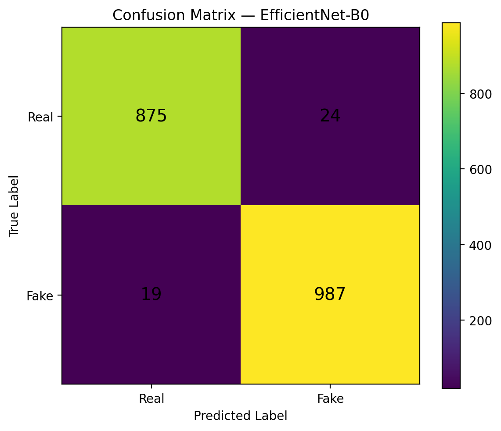
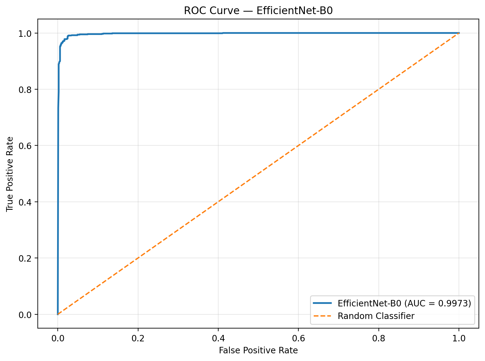
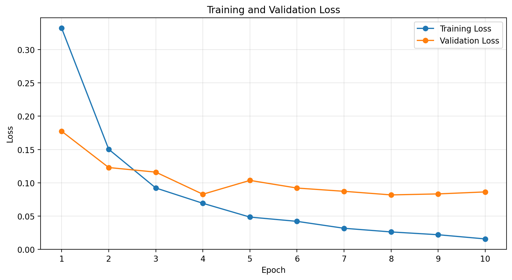
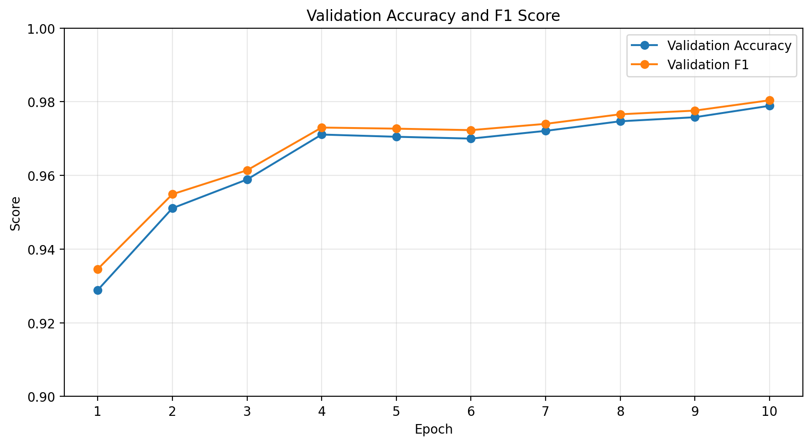
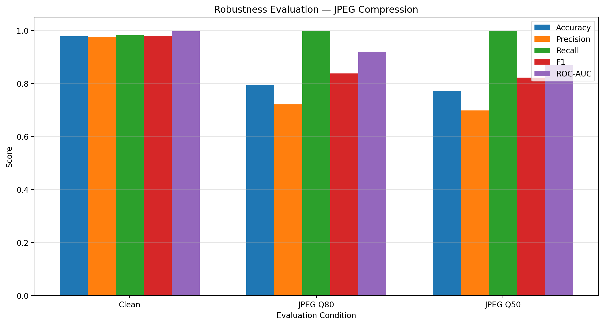

# Deepfake Image Detection using EfficientNet-B0

A deep learning project for classifying face images as **Real** or **Fake** using a pretrained **EfficientNet-B0** model fine-tuned for binary classification.

The project focuses on detecting synthetic face images generated by GAN-based methods represented in the **StyleGAN/StyleGAN2 Deepfake Face Images** dataset.

> **Important scope:** This is a real-vs-synthetic face image classifier for the evaluated dataset distribution. It is not a universal detector for every kind of deepfake, manipulated image, illustration, anime character, or video.

---

## Demo

The project includes a Streamlit application where users can upload a face image and receive:

- Real/Fake prediction
- Prediction confidence
- Real probability
- Fake probability

The application uses the trained EfficientNet-B0 checkpoint.

---

## Model

**Architecture:** EfficientNet-B0  
**Pretraining:** ImageNet  
**Task:** Binary image classification  
**Classes:**

- `0` → Real
- `1` → Fake

The original ImageNet classification head was replaced with a two-class classifier:

```text
EfficientNet-B0
      ↓
Dropout
      ↓
Linear(1280 → 2)
      ↓
Real / Fake
```

### Training configuration

| Setting | Value |
|---|---|
| Input size | 224 × 224 |
| Batch size | 64 |
| Optimizer | AdamW |
| Learning rate | 1e-4 |
| Weight decay | 1e-4 |
| Loss | Cross-Entropy |
| Scheduler | ReduceLROnPlateau |
| AMP | CUDA mixed precision |
| Epochs | 10 |

### Training augmentation

The training pipeline used:

- Random horizontal flip
- Random rotation up to 15°
- Color jitter
- ImageNet normalization

Validation and test images used resizing and ImageNet normalization without random augmentation.

---

## Dataset

The project used the **StyleGAN/StyleGAN2 Deepfake Face Images** dataset obtained through Kaggle.

Dataset composition:

| Category | Images |
|---|---:|
| Real | 5,890 |
| Fake | 7,000 |
| **Total** | **12,890** |

The dataset contained both original and augmented images.

### Data leakage prevention

Because augmented images can originate from the same underlying source image, a standard random image-level split could allow related images to appear across training and evaluation sets.

To reduce this risk, images were grouped using their shared base image identity before splitting.

Final split:

| Split | Images |
|---|---:|
| Training | 9,085 |
| Validation | 1,900 |
| Test | 1,905 |

The test set was kept separate from training and model development.

---

## Final Test Results

The final checkpoint was reloaded from disk and evaluated on the frozen 1,905-image test set.

| Metric | Result |
|---|---:|
| **Accuracy** | **97.74%** |
| **Precision** | **97.63%** |
| **Recall** | **98.11%** |
| **F1 Score** | **97.87%** |
| **ROC-AUC** | **99.71%** |

### Confusion Matrix

```text
                 Predicted
                 Real   Fake

Actual Real       875    24
Actual Fake        19   987
```

This corresponds to:

- 875 Real images correctly classified
- 987 Fake images correctly classified
- 24 Real images classified as Fake
- 19 Fake images classified as Real



---

## ROC Curve

The ROC curve was generated from predictions on the frozen test set.

**ROC-AUC: 99.71%**



---

## Training Behaviour

The model was trained for 10 epochs. Training and validation loss, validation accuracy, and validation F1 were tracked throughout training.





---

## Robustness Evaluation

To test sensitivity to image compression, the frozen checkpoint was evaluated on the same test images after applying JPEG compression in memory.

No retraining or threshold tuning was performed for these robustness experiments.

| Condition | Accuracy | Precision | Recall | F1 | ROC-AUC |
|---|---:|---:|---:|---:|---:|
| **Clean** | **97.74%** | **97.63%** | **98.11%** | **97.87%** | **99.71%** |
| JPEG Quality 80 | 79.48% | 72.07% | 99.80% | 83.70% | 91.91% |
| JPEG Quality 50 | 77.06% | 69.77% | 99.80% | 82.13% | 86.88% |



### Interpretation

The model performs strongly on the clean test distribution but shows substantial degradation under JPEG compression.

An important pattern is that Fake recall remains very high while precision decreases substantially. This means compressed real images are increasingly likely to be classified as Fake.

This demonstrates that clean-test performance alone does not fully characterize robustness.

---

## Error Analysis

The held-out test set contained **38 classification errors** in the earlier detailed error analysis of the evaluated model outputs.

The analysis included:

- Real → Fake errors
- Fake → Real errors
- Prediction confidence
- Most uncertain errors
- Most confident errors
- Repeated errors involving the same underlying source image
- Original vs augmented image error rates

The analysis also showed that some difficult real images could receive high-confidence Fake predictions.

These findings motivated the robustness experiments and the emphasis on the model's intended input distribution.

---

## Out-of-Distribution Behaviour

The application was also manually tested on images outside the training distribution, including anime/illustration images.

The model classified anime character images as Real during these tests.

This is an important limitation rather than a contradiction of the clean test results.

The model was trained on photographic face images and evaluated primarily on the corresponding real-vs-synthetic face-image distribution. An anime character is outside that distribution, so its prediction should not be interpreted as evidence that the character image is a genuine photograph.

---

## Limitations

This project has several important limitations:

1. **Dataset scope**  
   The primary dataset represents StyleGAN/StyleGAN2 synthetic face imagery rather than every modern deepfake generation technique.

2. **Image-only detection**  
   The system detects individual images and does not analyze temporal artifacts in videos.

3. **Out-of-distribution inputs**  
   Illustrations, anime images, heavily edited images, screenshots, and other non-photographic content may produce unreliable predictions.

4. **Compression sensitivity**  
   JPEG compression caused substantial performance degradation in the robustness experiment.

5. **Generalization**  
   High performance on this dataset does not establish equivalent performance on unseen generators, datasets, cameras, editing pipelines, or real-world social-media images.

6. **No universal deepfake guarantee**  
   A prediction should be treated as a model output, not definitive proof that an image is authentic or manipulated.

---

## Project Structure

```text
Deepfake_Detection_Project/
│
├── app.py
├── requirements.txt
│
├── model/
│   └── best_efficientnet_b0.pth
│
├── notebooks/
│   └── DeepFake_Face_Detection.ipynb
│
└── results/
    ├── confusion_matrix.png
    ├── final_metrics.json
    ├── robustness_comparison.png
    ├── roc_curve.png
    ├── training_loss.png
    └── validation_metrics.png
```

---

## Running the Streamlit Application

Install the required packages:

```bash
pip install -r requirements.txt
```

Run the application:

```bash
streamlit run app.py
```

Then open the local Streamlit URL shown in the terminal.

Upload a JPG or PNG face image to obtain a prediction.

---

## Reproducibility

The repository contains:

- The training notebook
- The trained model checkpoint
- The Streamlit application
- The dependency file
- Evaluation figures
- Final evaluation metrics

The raw dataset is not included in this repository.

The test set was kept frozen during the final evaluation and robustness experiments.

---

## Future Work

Potential extensions include:

- Evaluation on external deepfake datasets
- Testing against unseen GAN architectures
- Testing diffusion-generated faces
- Cross-dataset generalization experiments
- More extensive compression and image-quality testing
- Explainability using Grad-CAM
- Comparison with ResNet and MobileNet architectures
- GAN/adversarial training for detector development
- Video-based deepfake detection

A separate future experiment can investigate whether adversarial/GAN-based training improves generalization against increasingly realistic synthetic images.

---

## Technologies

- Python
- PyTorch
- Torchvision
- EfficientNet-B0
- Scikit-learn
- Pillow
- Matplotlib
- Streamlit
- Google Colab
- NVIDIA L4 GPU

---

## Disclaimer

This project is an experimental machine-learning system intended for research and educational purposes.

Its predictions should not be treated as definitive evidence of image authenticity. Performance depends on the image distribution, generation method, image quality, and other factors that may differ from the training and evaluation data.

---

## Author

**Yogya Srivastava**

B.Tech — Computer Science & Engineering (AI & ML)

Built as a deep learning and computer vision portfolio project.
